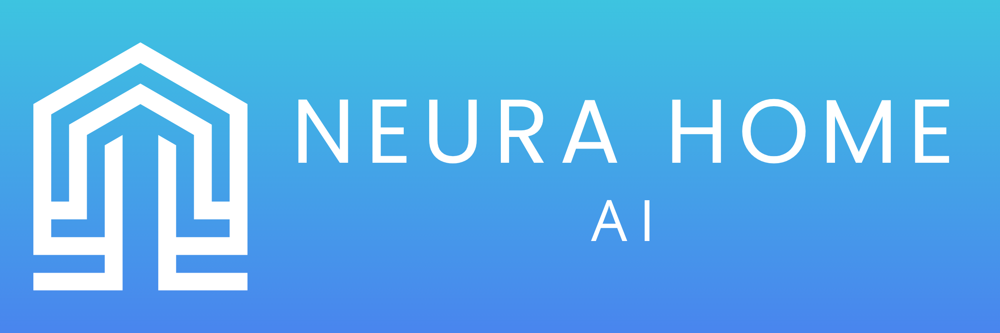
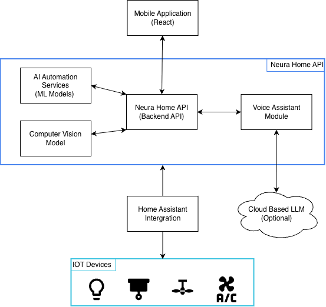

<p align="center">
  
</p>

# Neura Home

An AI-driven smart home backend platform that powers device control, behavioural learning, computer vision integration, and natural language voice interaction for the Neura Home ecosystem.

<div align="center">
  <a href="https://neurahome.me">
    
    Website
  </a>
  &nbsp;&nbsp;|&nbsp;&nbsp;
  <a href="https://www.youtube.com/watch?v=8MGqcfFiD_Q">
    
    Demo Video
  </a>
  &nbsp;&nbsp;|&nbsp;&nbsp;
  <a href="https://www.instagram.com/neurahome42">
    
    Instagram
  </a>
</div>

**Note:** This repository contains the **backend hub, AI services, and system orchestration** for the Neura Home platform. The mobile frontend application is maintained in a separate repository.

- **Frontend Repository:** https://github.com/reece071005/neura-home

## Table of Contents
- [Overview](#overview)
- [Features](#features)
- [System Architecture](#system-architecture)
- [Getting Started](#getting-started)
- [Usage](#usage)
- [Backend Tech Stack](#backend-tech-stack)

## Overview

Neura Home is an AI-driven smart home system designed to move beyond traditional rule-based automation. Instead of relying only on manually configured schedules or simple triggers, the backend platform collects and analyses historical smart home data, including device states, room activity, and environmental signals, to learn behavioural patterns and support predictive automation.

The backend acts as the central hub of the Neura Home ecosystem. It integrates with Home Assistant to control connected IoT devices such as lights, climate systems, blinds, fans, and cameras. It also manages user accounts, room configuration, personalised dashboards, notifications, and AI training workflows.

The platform includes multiple intelligent services working together. These include behavioural routine prediction using time-series data, computer vision for event detection and resident awareness, and a voice assistant that combines rule-based command execution with large language model support. These services are deployed as containerised microservices and communicate through a central FastAPI-based backend hub.

Neura Home follows a local-first architecture in which the core backend, AI services, and device control run locally on the Neura Home Hub. This design prioritises privacy, reliability, and low-latency smart home interaction while still allowing optional cloud-connected capabilities, such as the large language model used by the voice assistant.

## Features

- **Smart Home Device Control**  
  The backend integrates with Home Assistant to provide unified control of connected IoT devices, including lights, climate systems, blinds, fans, cameras, and other supported entities.

- **AI Routine Learning**  
  The system analyses historical smart home data stored in InfluxDB to learn behavioural patterns and predict future actions within each room. These learned patterns are used to generate suggestions and support intelligent automation.

- **Per-Room AI Automation**  
  AI-driven behaviour can be enabled or disabled for individual rooms. This allows users to decide where predictive automation should be active and where they prefer manual control.

- **AI Model Training Management**  
  The backend supports both manual and scheduled retraining of room-based AI models. Users can configure training frequency per room and monitor whether sufficient data is available for training.

- **Climate Preconditioning**  
  The backend supports AI-assisted climate preconditioning using room preferences such as arrival time, temperature bounds, lead time, and fallback temperature. When supported by trained models and available data, the system can suggest or perform preconditioning actions before arrival.

- **Fan Comfort Prediction**  
  The system can support predictive fan control using room fan history and thermostat context, allowing fan suggestions to be generated as part of room comfort automation.

- **Computer Vision Integration**  
  A dedicated vision service analyses camera snapshots to detect residents, unknown individuals, deliveries, and other events. Detection results are stored and surfaced as notifications through the backend.

- **Resident Recognition and Tracking**  
  Known user faces can be registered in the system, allowing the vision service to distinguish recognised residents from strangers and provide contextual responses such as last known resident location.

- **Voice Assistant API**  
  The backend supports natural language voice control through speech-to-text, rule-based intent parsing, contextual resident/delivery queries, and fallback LLM responses.

- **User Accounts and Role-Based Access**  
  The system supports multiple users with role-based permissions, including administrator and standard user roles. Administrators can manage users and system-wide settings, while standard users can interact with devices and AI features.

- **Notifications and Event Logging**  
  The backend stores AI-generated notifications, device-related updates, and vision alerts, enabling transparency around automation decisions and observed environmental events.

- **Local-First Microservice Architecture**  
  Core backend logic, AI models, notifications, and vision services run locally within the Neura Home Hub environment using Docker-based microservices, enabling low-latency automation and improved privacy.

## System Architecture

Neura Home follows a local-first architecture designed to provide reliable, low-latency smart home control while maintaining strong privacy guarantees.

The diagram below illustrates the high-level architecture of the Neura Home system.

<p align="center">
  
</p>

The backend hub communicates with:

- A **Home Assistant** instance for device control and state monitoring
- An **InfluxDB** instance for time-series smart home data
- A **PostgreSQL** database for application data such as users, rooms, and notifications
- A **Redis** instance for caching and AI-related preference storage
- A dedicated **AI service** for room-based predictive models
- A dedicated **vision service** for camera analysis and resident/event detection
- The **mobile frontend application** over the local network

## Getting Started

The following steps describe how to run the **Neura Home backend hub and AI services** in a development environment.

The backend is built around **FastAPI**, **Docker Compose**, and several supporting services including PostgreSQL, Redis, InfluxDB, an AI microservice, and a vision microservice.

### Prerequisites

Before running the backend, ensure the following tools are installed:

- **Python 3.11** or later
- **Docker**
- **Docker Compose**
- **Git**

You will also need access to:

- A running **[Home Assistant](https://github.com/home-assistant/core)** instance
- A valid **Home Assistant Long-Lived Access Token**
- A local environment capable of running Docker containers for the Neura Home services

### Installation

```bash
# Clone the repository
git clone https://github.com/reece071005/neura-home-backend.git
cd neura-home-backend